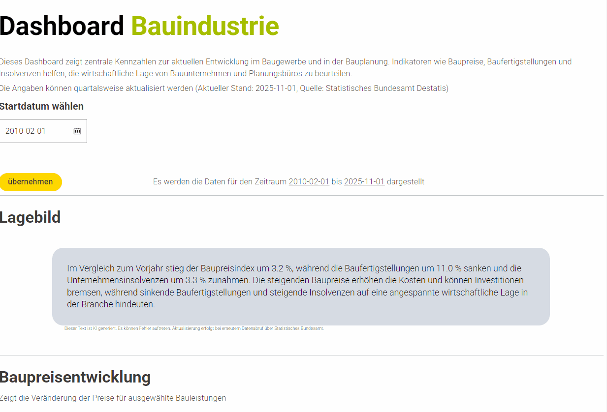
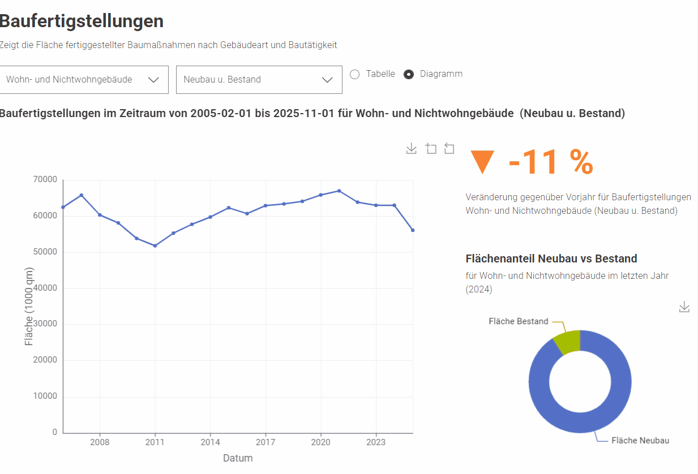

# Dashboard Bauindustrie (KNIME)

## Überblick

Dieses Projekt umfasst ein interaktives Dashboard zur Analyse zentraler Kennzahlen der Bauindustrie in Deutschland. Ziel ist es, aktuelle Marktentwicklungen datenbasiert zu bewerten und ein kompaktes Lagebild für Unternehmen und Planungsbüros bereitzustellen.

## Demo





## Inhalt des Dashboards

Das Dashboard basiert auf folgenden zentralen Kennzahlen:

* **Baupreisentwicklung**
  Analyse der Preisentwicklung ausgewählter Bauleistungen (quartalsweise Daten)

* **Baufertigstellungen**
  Auswertung fertiggestellter Flächen nach Gebäudeart und Bautätigkeit (jährliche Daten)

* **Unternehmensinsolvenzen**
  Entwicklung der Insolvenzen im Baugewerbe und bei Planungsbüros (monatliche Daten)

* **Lagebild (KI-gestützt)**
  Automatisierte Zusammenfassung und Interpretation der aktuellen Entwicklung im Vergleich zum Vorjahr

## Funktionen

* Dynamische Zeitraumauswahl für alle Kennzahlen
* Interaktive Auswahl von:

  * Bauleistungen
  * Gebäudearten und Bautätigkeiten
  * Branchen (z. B. Baugewerbe, Planungsbüros)
* Umschaltung zwischen Diagramm und Tabellenansicht
* Automatische Berechnung von:

  * Veränderungsraten
  * Anteilen (z. B. Neubau vs. Bestand)
* Visuelle Trendbewertung (Ampellogik)

## Technologie

* KNIME Analytics Platform
* Destatis API
* Google AI API (für Textgenerierung)

## Voraussetzungen

Zum Ausführen werden benötigt:

* Destatis API Key
* Google AI API Key

Diese müssen im Credential Widget im KNIME-Workflow hinterlegt werden.

## Projektstruktur

```id="d0c0tf"
.
├── workflow/
│   └── dashboard_bauindustrie.knar
├── images/
│   ├── dashboard_overview.gif
│   └── dashboard_interaction.gif
└── README.md
```

## Verwendung

1. KNIME öffnen
2. Workflow importieren (`.knar`)
3. API Keys im Credential Widget hinterlegen
4. Workflow ausführen
5. Dashboard über die integrierten Views nutzen


---
